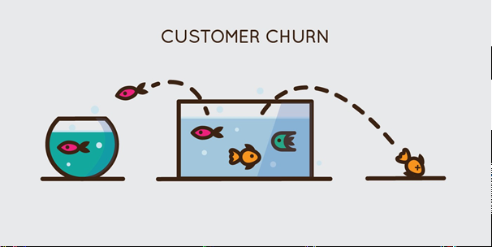

# Attrition des jeune en banque
Le nombre de clients quittant leur banque a presque doublé en trois ans en France. Les banques traditionnelles pourraient perdre un quart de leur revenu si elles ne réagissent pas. La maîtrise de l’attrition clients (Taux de départ, appelé “Churn” par les Anglo-saxons) est donc devenue primordiale ! Cette plus grande volatilité des clients oblige les banques à accentuer les actions de fidélisation. En effet, c’est le meilleur investissement marketing possible, car le coût pour fidéliser un client existant est bien moindre que pour en acquérir un nouveau. Toutefois, pour être réellement efficaces, ces actions doivent être finement ciblées.
# Requirements
Les installer à partir de ``requirements.txt``: 
``pip install -r requirements.txt``
# Déploiement Local 
lancer le serveur :
``python app.py``
# Licence
